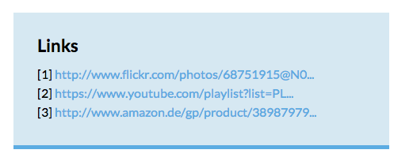
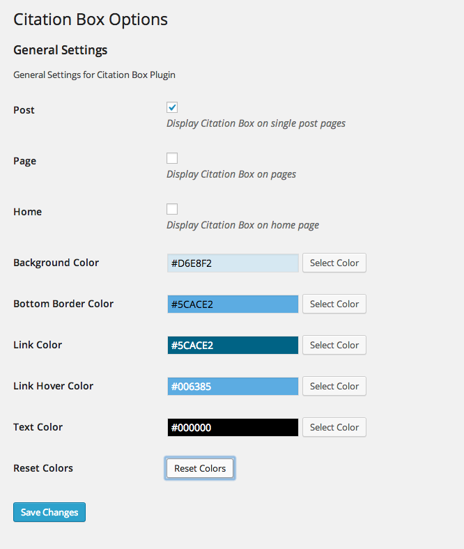

Citation Box
============
__Author:__ [Hans-Helge Buerger](http://hanshelgebuerger.de)  
__Date:__ 20. March 2014  
__Version:__ v0.1  
__License:__ MIT  

***

This is a simple WordPress Plugin which takes the content and scans it for links and puts them at the end of a page in a box. And this looks like this.

Installation
------------

* Download the [`ZIP` File](https://github.com/obstschale/citationbox/archive/master.zip) and upload it via your backend in WordPress
* Upload the `citation-box` folder to `/wp-content/plugins/` directory

In more detail
--------------

This plugin uses `the_content` filter and goes through the DOM Tree to look for `<a>` tags (exceptions are: images and WordPress more-link). The link is extracted form the content and a number is added after the former link. The link itself will be added to a list at the end of each site.

In the settings you can decide where this box is displayed. The first option will add a box at each post if the single post is viewed. The second is for pages and `Home` is referring to the main page where you can browser your articles. In addition, it is possible to choose own colors to fit perfectly to your theme.

BTW: If no links are found in a post / page also no Citation Box is shown.

### Settings

Languages
---------

_Citation Box_ is translated in:

* German: special thanks to [myself](https://github.com/obstschale).

License
-------

_Citation Box_ is licensed under the MIT license. Please see `LICENSE`.
